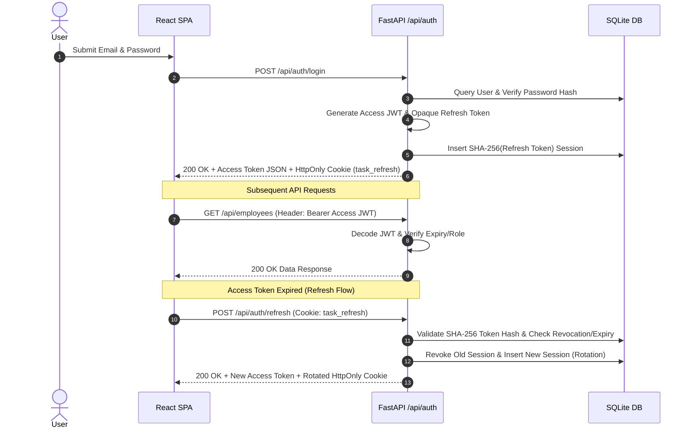

# Authentication & Authorization Architecture

## 🔑 Session & Token Architecture

The system uses a hybrid authentication model combining short-lived **JWT Access Tokens** with secure **HttpOnly Refresh Cookies**:

---

## 🛡️ Key Security Features Implemented

1. **Password Protection**: Plaintext passwords are never stored. Passwords are hashed using `pwdlib` (`Argon2`/`Bcrypt`).
2. **Refresh Token Hashing**: Opaque refresh tokens are generated via `secrets.token_urlsafe(48)`. Only their SHA-256 hash is persisted in the database.
3. **Cookie Hardening**: Refresh tokens are stored in `HttpOnly` cookies (`path="/api/auth"`), preventing client-side JavaScript (XSS) from reading them.
4. **Token Rotation**: Every call to `/api/auth/refresh` revokes the old session and issues a new refresh token.
5. **Role-Based Access Control (RBAC)**: Enforced via `require_admin` dependency in [`dependencies.py`](file:///d:/Task-Management/backend/app/api/dependencies.py#L54-L63).
