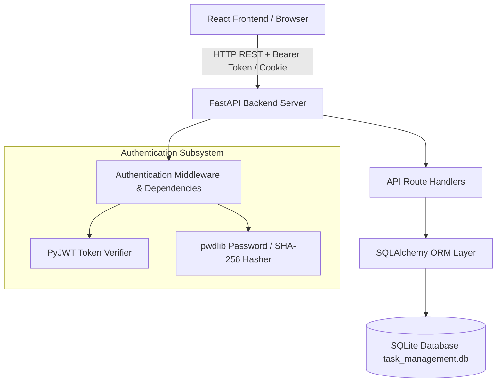

# System Architecture Overview

## 🏗️ Architectural Topology

The system is designed as a decoupled client-server architecture consisting of a React single-page application (SPA) communicating over RESTful HTTP APIs with a FastAPI Python backend.

---

## 🔄 Request Processing Pipeline

1. **Client Request**: Client issues HTTP request with JSON payload or URL parameters.
2. **CORS Middleware**: [`main.py`](file:///d:/Task-Management/backend/app/main.py#L21-L27) checks request origin (`http://localhost:5173`).
3. **Authentication Guard**: [`dependencies.py`](file:///d:/Task-Management/backend/app/api/dependencies.py) extracts `Authorization: Bearer <token>`, decodes payload using `JWT_SECRET_KEY`, and queries `User`.
4. **Authorization Guard**: `require_admin` dependency checks if `user.role == "admin"`.
5. **Business Logic & Schema Validation**: Pydantic models validate input. Route handlers invoke SQLAlchemy transactions.
6. **Database Persistence**: Session commits changes to SQLite `task_management.db`.
7. **Response Serialization**: Pydantic models format outgoing JSON response.
