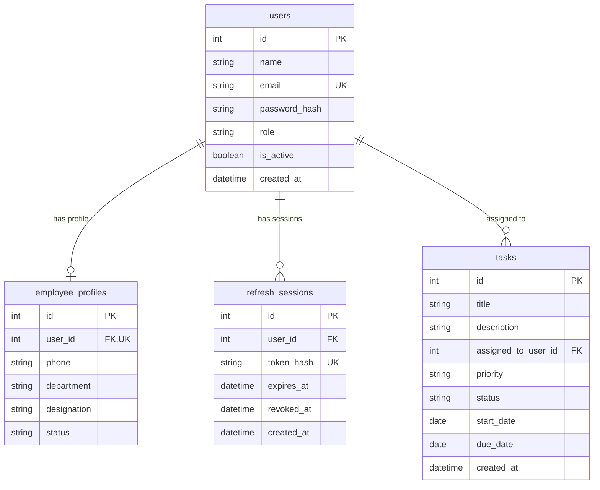

# Data Model & Database Schema

Database Engine: **SQLite 3** (`task_management.db`)  
ORM: **SQLAlchemy 2.1+**

---

## 📊 Entity Relationship Diagram (ERD)

---

## 🗄️ Detailed Table Definitions

### 1. `users` Table ([`user.py`](file:///d:/Task-Management/backend/app/models/user.py))
* `id` (INTEGER, Primary Key, Autoincrement, Indexed)
* `name` (VARCHAR(100), NOT NULL)
* `email` (VARCHAR(255), UNIQUE, INDEX, NOT NULL)
* `password_hash` (VARCHAR(255), NOT NULL)
* `role` (VARCHAR(20), NOT NULL, Default: `"employee"`)
* `is_active` (BOOLEAN, NOT NULL, Default: `True`)
* `created_at` (DATETIME(timezone=True), NOT NULL, Default: UTC Now)

### 2. `employee_profiles` Table ([`employee_profile.py`](file:///d:/Task-Management/backend/app/models/employee_profile.py))
* `id` (INTEGER, Primary Key, Autoincrement, Indexed)
* `user_id` (INTEGER, Foreign Key `users.id`, UNIQUE, NOT NULL)
* `phone` (VARCHAR(20), NOT NULL)
* `department` (VARCHAR(100), NOT NULL)
* `designation` (VARCHAR(100), NOT NULL)
* `status` (VARCHAR(20), NOT NULL, Default: `"active"`)

### 3. `refresh_sessions` Table ([`refresh_session.py`](file:///d:/Task-Management/backend/app/models/refresh_session.py))
* `id` (INTEGER, Primary Key, Autoincrement, Indexed)
* `user_id` (INTEGER, Foreign Key `users.id`, INDEX, NOT NULL)
* `token_hash` (VARCHAR(64), UNIQUE, INDEX, NOT NULL) - SHA-256 Hash
* `expires_at` (DATETIME(timezone=True), NOT NULL)
* `revoked_at` (DATETIME(timezone=True), Nullable)
* `created_at` (DATETIME(timezone=True), NOT NULL, Default: UTC Now)

### 4. `tasks` Table ([`task.py`](file:///d:/Task-Management/backend/app/models/task.py))
* `id` (INTEGER, Primary Key, Autoincrement, Indexed)
* `title` (VARCHAR(200), NOT NULL)
* `description` (TEXT, Nullable)
* `assigned_to_user_id` (INTEGER, Foreign Key `users.id`, INDEX, NOT NULL)
* `priority` (VARCHAR(20), NOT NULL, Default: `"Medium"`)
* `status` (VARCHAR(20), NOT NULL, Default: `"Pending"`)
* `start_date` (DATE, NOT NULL)
* `due_date` (DATE, NOT NULL)
* `created_at` (DATETIME(timezone=True), NOT NULL, Default: UTC Now)
